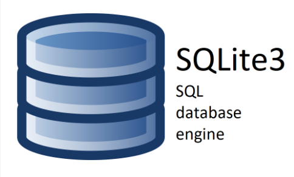

Base de données et modèles
==========================

Description de la structure de la base de données et des modèles de données.

.. |sqlite-logo| image:: _static/sqlite.svg
   :alt: SqLite Logo
   :width: 80px

.. |python-logo| image:: _static/python.svg
   :alt: Python Logo
   :width: 20px

Structure de la base de données |sqlite-logo|
---------------------------------------------

Dans le cadre de ce projet Django, nous avons choisi d’utiliser SQLite3 comme base de données. Ce système de gestion de bases de données relationnelles est léger, performant et adapté aux applications web de petite ou moyenne envergure.

L’un des principaux atouts de SQLite3 est sa simplicité d’utilisation et sa portabilité. Du fait de son intégration à Django, il n’est pas nécessaire d’installer un système de gestion de base de données externe. Vous pouvez accéder à votre base de données SQLite3 de deux façons principales :

1. **Via la ligne de commande SQLite3 CLI :** Vous pouvez utiliser l'outil en ligne de commande SQLite3 CLI pour interagir avec la base de données, exécuter des requêtes SQL, et examiner les données. Pour utiliser cet outil, assurez-vous d'avoir SQLite3 installé sur votre système, puis exécutez la commande `sqlite3 chemin_vers_la_base_de_données` pour ouvrir la base de données.

2. **Via l'interface d'administration de Django :** Django fournit une interface d'administration conviviale qui permet de gérer facilement les données de l'application. Vous pouvez accéder à cette interface en démarrant le serveur de développement Django et en vous rendant sur la page d'administration dans votre navigateur web a l'adresse (http://127.0.0.1:8000/admin/). À partir de là, vous pouvez ajouter, modifier ou supprimer des données, et effectuer diverses opérations de gestion de la base de données.

**Utilisation de SQLite3** |sqlite3-logo|

- Démarrer sqlite3 :

.. code-block:: shell

   (venv) <repertoire_du_projet>\OC-P13\>sqlite3
   SQLite version 3.37.2 2022-01-06 13:25:41
   Enter ".help" for usage hints.

- Pour ouvrir une base de données existante, utilisez la commande suivante :

.. code-block:: shell

   .open oc-lettings-site.sqlite3

- Pour afficher la liste des tables dans la base de données, utilisez la commande :

.. code-block:: shell

   .tables

- Pour afficher les informations sur les colonnes de la table "profiles_profile", utilisez la commande suivante :

.. code-block:: shell

   pragma table_info(profiles_profile);

- Pour effectuer une requête sur la table "profiles_profile" pour sélectionner les utilisateurs dont la ville favorite commence par "B", utilisez la commande suivante :

.. code-block:: shell

   SELECT user_id, favorite_city FROM profiles_profile WHERE favorite_city LIKE 'B%';

- Pour quitter SQLite3, utilisez la commande suivante :

.. code-block:: shell

   .quit

Modèles de données |python-logo|
--------------------------------

Les modèles de données sont essentiels pour la définition de la structure de la base de données et la gestion des informations de l'application. Dans notre projet, nous utilisons le langage de programmation Python pour créer ces modèles.

Les modèles Django représentent les différentes entités et relations au sein de l'application. Chaque modèle est associé à une table de base de données, et les champs du modèle correspondent aux colonnes de la table. Ces modèles permettent de définir comment les données seront stockées et manipulées.

Par exemple, voici un modèle de classe de notre projet :

.. code-block:: python

   from django.db import models

    class Letting(models.Model):
        """Represents a letting

        Attributes:
            title (str): letting name
            address (obj): Address object
        """
        title = models.CharField(max_length=256)
        address = models.OneToOneField(Address, on_delete=models.CASCADE)

        def __str__(self):
            "Returns a string containing the title"
            return self.title

Dans cet exemple, nous avons un modèle de données appelé **Letting** avec des champs tels que **title** et **address**.

Les relations entre les modèles, comme les clés primaires et étrangères, sont également établies directement dans les modèles Django, ce qui assure la cohérence et l’intégrité des données.

Le fait de définir les modèles en Python rend la création et la gestion de la base de données plus simple : il suffit d’utiliser des classes Python pour représenter les modèles, ce qui rend le code clair et facile à maintenir.

En résumé, l’association de SQLite3 et des modèles Django constitue le socle de données de l’application, permettant de stocker et d’accéder rapidement aux informations indispensables au bon fonctionnement du site web.